# AutoTouch Pro 安卓自动操作录制回放软件 - 详细设计文档

---

## 目录

1. [项目概述](#1-项目概述)
2. [完整需求列表](#2-完整需求列表)
3. [用户常规操作流程](#3-用户常规操作流程)
4. [代码目录设计](#4-代码目录设计)
5. [架构设计](#5-架构设计)
6. [界面主题与配色设计](#6-界面主题与配色设计)
7. [业务逻辑设计](#7-业务逻辑设计)
8. [测试设计](#8-测试设计)
9. [版权与授权设计](#9-版权与授权设计)
10. [开发方案设计](#10-开发方案设计)
11. [交互设计](#11-交互设计)
12. [更新设计](#12-更新设计)
13. [项目命名与包名设计](#13-项目命名与包名设计)
14. [安全设计](#14-安全设计)
15. [错误处理与异常设计](#15-错误处理与异常设计)
16. [日志与监控设计](#16-日志与监控设计)
17. [部署与发布设计](#17-部署与发布设计)
18. [兼容性适配设计](#18-兼容性适配设计)

---

## 1. 项目概述

### 1.1 项目简介

**AutoTouch Pro（触控精灵专业版）** 是一款基于 Android 无障碍服务开发的自动化操作录制与回放工具。用户可以通过悬浮窗一键录制自己在手机上的所有操作（点击、滑动、长按等），并将录制的操作脚本保存下来，随时一键回放执行。

### 1.2 核心价值

- **效率提升**：重复性操作一键自动化，解放双手
- **操作精准**：精确还原用户操作路径与时间间隔
- **全局支持**：支持在所有应用界面录制和回放，不限于本应用
- **脚本管理**：多脚本保存、编辑、导入导出

### 1.3 目标用户

- 手游玩家（自动刷任务、签到）
- 测试人员（自动化测试脚本录制）
- 办公人群（重复性办公操作自动化）
- 技术爱好者（自动化流程创作）

---

## 2. 完整需求列表

### 2.1 功能需求

#### 2.1.1 录制功能

| 序号 | 功能点 | 描述 | 优先级 |
|------|--------|------|--------|
| R-001 | 点击录制 | 录制用户的单击、双击、长按操作 | P0 |
| R-002 | 滑动录制 | 录制用户的上下左右滑动、拖拽操作 | P0 |
| R-003 | 延迟等待 | 自动记录操作之间的时间间隔 | P0 |
| R-004 | 全局录制 | 支持在所有应用界面录制，不限于本应用 | P0 |
| R-005 | 悬浮控制 | 通过悬浮窗进行开始/暂停/停止录制 | P0 |
| R-006 | 录制计时 | 显示当前录制时长 | P1 |
| R-007 | 操作计数 | 实时显示已录制操作数量 | P1 |
| R-008 | 暂停录制 | 支持暂停后继续录制 | P1 |
| R-009 | 手势录制 | 支持复杂手势路径录制 | P2 |

#### 2.1.2 回放功能

| 序号 | 功能点 | 描述 | 优先级 |
|------|--------|------|--------|
| R-101 | 单次回放 | 执行一次完整脚本 | P0 |
| R-102 | 循环回放 | 支持设置循环次数或无限循环 | P0 |
| R-103 | 循环间隔 | 设置每次循环之间的等待时间 | P1 |
| R-104 | 回放速度 | 支持 0.5x / 1x / 2x / 3x 倍速回放 | P1 |
| R-105 | 回放暂停 | 支持暂停/继续回放 | P1 |
| R-106 | 进度显示 | 显示当前回放进度 | P1 |
| R-107 | 一键停止 | 随时终止回放执行 | P0 |
| R-108 | 异常处理 | 回放异常时自动停止并提示 | P1 |

#### 2.1.3 脚本管理

| 序号 | 功能点 | 描述 | 优先级 |
|------|--------|------|--------|
| R-201 | 脚本保存 | 将录制的操作保存为脚本文件 | P0 |
| R-202 | 脚本列表 | 展示所有已保存的脚本 | P0 |
| R-203 | 脚本重命名 | 支持修改脚本名称 | P1 |
| R-204 | 脚本删除 | 删除不需要的脚本 | P0 |
| R-205 | 脚本编辑 | 可视化编辑脚本中的操作步骤 | P1 |
| R-206 | 脚本复制 | 复制已有脚本生成副本 | P1 |
| R-207 | 脚本导出 | 将脚本导出为 JSON 文件 | P1 |
| R-208 | 脚本导入 | 导入外部脚本文件 | P1 |
| R-209 | 脚本搜索 | 按名称搜索脚本 | P2 |
| R-210 | 脚本分类 | 支持文件夹分类管理 | P2 |

#### 2.1.4 动作编辑功能

| 序号 | 功能点 | 描述 | 优先级 |
|------|--------|------|--------|
| R-401 | 动作列表展示 | 可视化展示脚本中所有动作步骤 | P0 |
| R-402 | 动作坐标修改 | 支持修改点击/滑动的坐标位置 | P0 |
| R-403 | 动作时间调整 | 支持修改动作的开始时间和持续时间 | P0 |
| R-404 | 动作类型修改 | 支持切换动作类型（点击/长按/滑动/等待） | P1 |
| R-405 | 新增动作 | 在指定位置插入新的动作步骤 | P0 |
| R-406 | 删除动作 | 删除不需要的动作步骤 | P0 |
| R-407 | 动作排序 | 支持拖拽调整动作顺序 | P1 |
| R-408 | 批量操作 | 支持批量选择、删除、移动动作 | P2 |
| R-409 | 插入等待 | 在动作之间插入等待时长 | P0 |
| R-410 | 坐标拾取 | 通过截图点击选择坐标位置 | P1 |
| R-411 | 动作预览 | 单步预览执行选中的动作 | P1 |
| R-412 | 撤销/重做 | 支持编辑操作的撤销和重做 | P1 |
| R-413 | 编辑保存 | 保存编辑后的脚本（可另存为新脚本） | P0 |
| R-414 | 滑动路径编辑 | 可视化编辑滑动的路径曲线 | P2 |
| R-415 | 动作备注 | 为动作添加文字备注说明 | P2 |
| R-416 | 时间轴视图 | 以时间轴形式展示和编辑动作 | P2 |

#### 2.1.5 权限管理

| 序号 | 功能点 | 描述 | 优先级 |
|------|--------|------|--------|
| R-301 | 无障碍权限 | 引导用户开启无障碍服务 | P0 |
| R-302 | 悬浮窗权限 | 引导用户开启悬浮窗权限 | P0 |
| R-303 | 文件管理权限 | 读写外部存储权限 | P0 |
| R-304 | 权限状态检测 | 实时检测各权限开启状态 | P0 |
| R-305 | 权限跳转 | 一键跳转到对应权限设置页面 | P0 |

### 2.2 非功能需求

| 序号 | 需求点 | 描述 | 优先级 |
|------|--------|------|--------|
| NFR-001 | 响应速度 | 悬浮窗响应延迟 < 100ms | P0 |
| NFR-002 | 录制精度 | 点击位置误差 < 5px | P0 |
| NFR-003 | 回放准确率 | 操作回放准确率 > 95% | P0 |
| NFR-004 | 内存占用 | 后台运行内存 < 100MB | P1 |
| NFR-005 | 电量消耗 | 连续录制1小时耗电 < 5% | P2 |
| NFR-006 | 兼容性 | 支持 Android 8.0 - Android 14 | P0 |
| NFR-007 | 稳定性 | 连续运行24小时无崩溃 | P1 |
| NFR-008 | 启动速度 | 冷启动时间 < 1s | P2 |

### 2.3 权限清单

#### 2.3.1 必须权限

| 权限 | 用途 | 申请时机 |
|------|------|----------|
| `android.permission.SYSTEM_ALERT_WINDOW` | 显示悬浮控制窗 | 首次启动引导 |
| `android.permission.FOREGROUND_SERVICE` | 前台服务保活 | 首次启动 |
| `android.permission.WAKE_LOCK` | 防止录制/回放时休眠 | 录制/回放开始时 |
| `android.permission.READ_EXTERNAL_STORAGE` | 读取脚本文件 | 脚本导入时 |
| `android.permission.WRITE_EXTERNAL_STORAGE` | 保存脚本文件 | 脚本保存时 |
| `android.permission.INTERNET` | 联网更新、统计 | 首次启动 |
| `android.permission.ACCESS_NETWORK_STATE` | 网络状态检测 | 首次启动 |
| `android.permission.VIBRATE` | 操作反馈震动 | 录制开始/结束 |

#### 2.3.2 可选权限

| 权限 | 用途 | 申请时机 |
|------|------|----------|
| `android.permission.CAMERA` | 扫码导入脚本 | 扫码功能使用时 |
| `android.permission.ACCESS_FINE_LOCATION` | 基于位置的自动化场景 | 高级功能使用时 |
| `android.permission.ACCESS_COARSE_LOCATION` | 粗略定位 | 高级功能使用时 |
| `android.permission.RECORD_AUDIO` | 语音控制（未来扩展） | 语音功能使用时 |
| `android.permission.POST_NOTIFICATIONS` | 运行状态通知 | Android 13+ 首次启动 |

#### 2.3.3 特殊权限（需用户手动开启）

| 权限 | 用途 | 引导方式 |
|------|------|----------|
| 无障碍服务 (AccessibilityService) | 监听和执行全局操作 | 跳转无障碍设置页 |
| 电池优化白名单 | 防止后台被系统杀死 | 跳转电池优化设置 |
| 自启动权限 | 开机自启动（可选） | 跳转自启动管理 |

---

## 3. 用户常规操作流程

### 3.1 首次使用流程

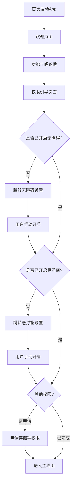

### 3.2 录制操作流程

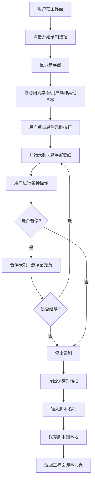

### 3.3 回放操作流程

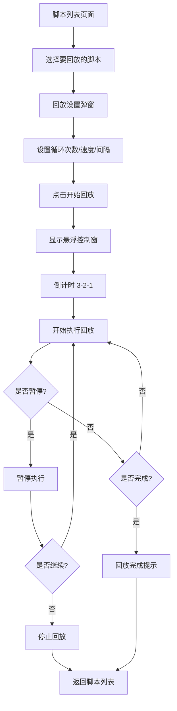

### 3.4 脚本管理流程

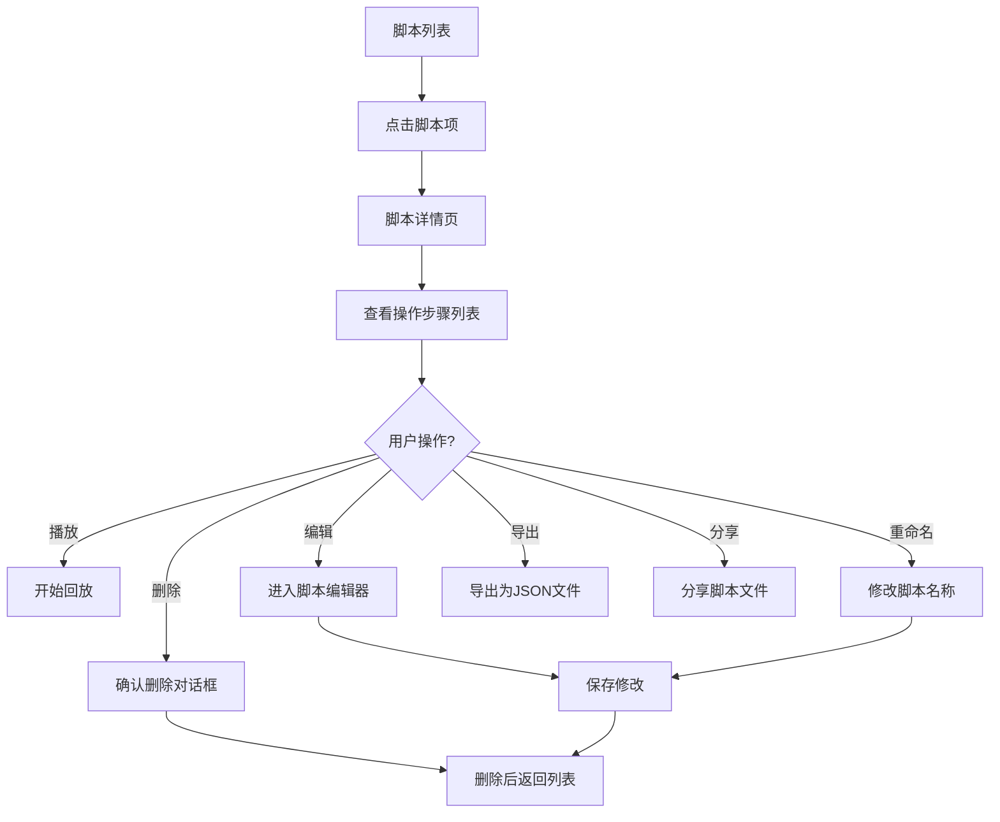

### 3.5 脚本编辑流程

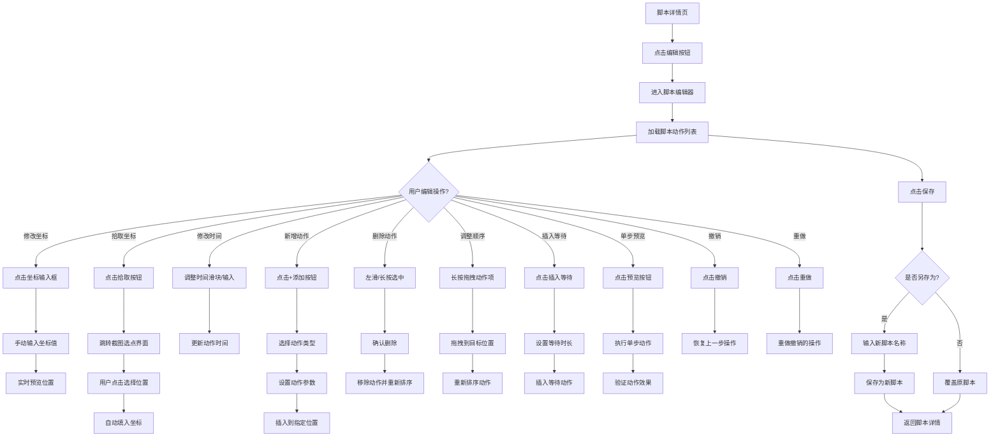

---

## 4. 代码目录设计

### 4.1 整体目录结构

```
app/
├── src/
│   ├── main/
│   │   ├── java/com/autotouch/pro/
│   │   │   ├── app/                    # 应用全局
│   │   │   │   ├── App.kt
│   │   │   │   └── AppContainer.kt
│   │   │   ├── ui/                     # UI层
│   │   │   │   ├── theme/              # 主题
│   │   │   │   │   ├── Color.kt
│   │   │   │   │   ├── Theme.kt
│   │   │   │   │   └── Type.kt
│   │   │   │   ├── components/         # 通用组件
│   │   │   │   │   ├── Button/
│   │   │   │   │   ├── Card/
│   │   │   │   │   ├── Dialog/
│   │   │   │   │   └── Floating/
│   │   │   │   ├── navigation/         # 导航
│   │   │   │   │   ├── NavGraph.kt
│   │   │   │   │   └── Routes.kt
│   │   │   │   ├── screens/            # 页面
│   │   │   │   │   ├── home/           # 首页
│   │   │   │   │   ├── script/         # 脚本管理
│   │   │   │   │   ├── editor/         # 脚本编辑器
│   │   │   │   │   │   ├── ScriptEditorScreen.kt
│   │   │   │   │   │   ├── ActionListItem.kt
│   │   │   │   │   │   ├── CoordinatePickerScreen.kt
│   │   │   │   │   │   ├── TimeLineView.kt
│   │   │   │   │   │   └── EditToolbar.kt
│   │   │   │   │   ├── settings/       # 设置
│   │   │   │   │   ├── guide/          # 权限引导
│   │   │   │   │   └── about/          # 关于
│   │   │   │   └── viewmodel/          # ViewModel
│   │   │   │       ├── ScriptEditorViewModel.kt
│   │   │   │       └── CoordinatePickerViewModel.kt
│   │   │   ├── service/                # 服务层
│   │   │   │   ├── accessibility/      # 无障碍服务
│   │   │   │   │   ├── TouchAccessibilityService.kt
│   │   │   │   │   ├── AccessibilityManager.kt
│   │   │   │   │   └── action/         # 操作执行器
│   │   │   │   ├── floating/           # 悬浮窗服务
│   │   │   │   │   ├── FloatingWindowService.kt
│   │   │   │   │   ├── FloatingManager.kt
│   │   │   │   │   └── view/
│   │   │   │   └── recorder/           # 录制服务
│   │   │   │       ├── RecordService.kt
│   │   │   │       └── RecordManager.kt
│   │   │   ├── data/                   # 数据层
│   │   │   │   ├── model/              # 数据模型
│   │   │   │   │   ├── Script.kt
│   │   │   │   │   ├── TouchAction.kt
│   │   │   │   │   └── ActionType.kt
│   │   │   │   ├── repository/         # 仓库
│   │   │   │   │   ├── ScriptRepository.kt
│   │   │   │   │   └── SettingsRepository.kt
│   │   │   │   ├── local/              # 本地存储
│   │   │   │   │   ├── db/             # Room数据库
│   │   │   │   │   ├── dao/
│   │   │   │   │   └── prefs/          # SharedPreferences
│   │   │   │   └── file/               # 文件管理
│   │   │   │       ├── ScriptFileManager.kt
│   │   │   │       └── JsonConverter.kt
│   │   │   ├── domain/                 # 领域层
│   │   │   │   ├── usecase/            # 用例
│   │   │   │   │   ├── RecordActionUseCase.kt
│   │   │   │   │   ├── ReplayScriptUseCase.kt
│   │   │   │   │   ├── ManageScriptUseCase.kt
│   │   │   │   │   └── EditActionUseCase.kt
│   │   │   │   ├── engine/             # 回放引擎
│   │   │   │   │   ├── ReplayEngine.kt
│   │   │   │   │   ├── ActionExecutor.kt
│   │   │   │   │   └── SpeedController.kt
│   │   │   │   └── editor/             # 脚本编辑引擎
│   │   │   │       ├── ScriptEditor.kt
│   │   │   │       ├── ActionEditor.kt
│   │   │   │       ├── CoordinatePicker.kt
│   │   │   │       ├── UndoManager.kt
│   │   │   │       └── EditHistory.kt
│   │   │   ├── util/                   # 工具类
│   │   │   │   ├── PermissionUtils.kt
│   │   │   │   ├── DisplayUtils.kt
│   │   │   │   ├── ToastUtils.kt
│   │   │   │   └── Logger.kt
│   │   │   └── extension/              # 扩展函数
│   │   ├── res/                        # 资源文件
│   │   │   ├── drawable/
│   │   │   ├── mipmap-*/
│   │   │   ├── values/
│   │   │   └── xml/
│   │   └── AndroidManifest.xml
│   └── test/                           # 单元测试
├── gradle/
├── build.gradle.kts
└── settings.gradle.kts
```

### 4.2 模块职责说明

| 模块 | 职责 | 关键类 |
|------|------|--------|
| **app** | 应用全局初始化、依赖注入容器 | App, AppContainer |
| **ui** | 所有界面相关代码，遵循 MVVM 模式 | Screen, ViewModel, Components |
| **service** | 后台服务，包含无障碍、悬浮窗、录制 | AccessibilityService, FloatingService |
| **data** | 数据层，负责数据持久化与文件管理 | Repository, DAO, FileManager |
| **domain** | 业务逻辑层，回放引擎、编辑引擎核心 | ReplayEngine, ActionExecutor, ScriptEditor |
| **editor** | 脚本编辑引擎，动作编辑、撤销重做、坐标拾取 | ScriptEditor, UndoManager, CoordinatePicker |
| **util** | 通用工具类 | PermissionUtils, DisplayUtils |

---

## 5. 架构设计

### 5.1 整体架构图

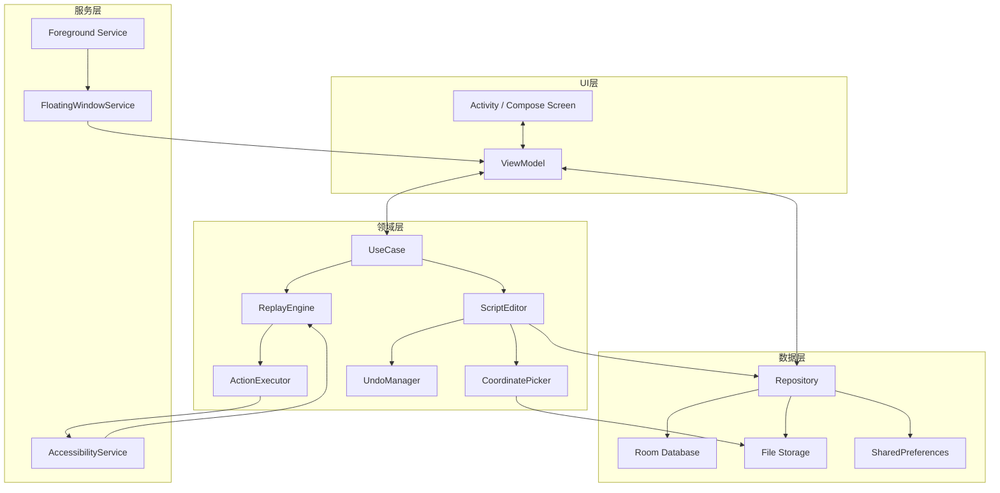

### 5.2 架构模式：MVVM + Clean Architecture

采用 **MVVM（Model-View-ViewModel）** 架构模式，结合 **Clean Architecture** 分层思想：

#### 5.2.1 分层原则

| 层级 | 职责 | 依赖方向 |
|------|------|----------|
| **UI层 (Presentation)** | 界面展示、用户交互 | 依赖 ViewModel、UseCase |
| **领域层 (Domain)** | 核心业务逻辑、用例编排 | 独立，不依赖其他层 |
| **数据层 (Data)** | 数据存储、网络请求 | 实现 Repository 接口 |
| **服务层 (Service)** | 后台服务、系统服务 | 独立运行，通过 Manager 与 UI 通信 |

#### 5.2.2 数据流向

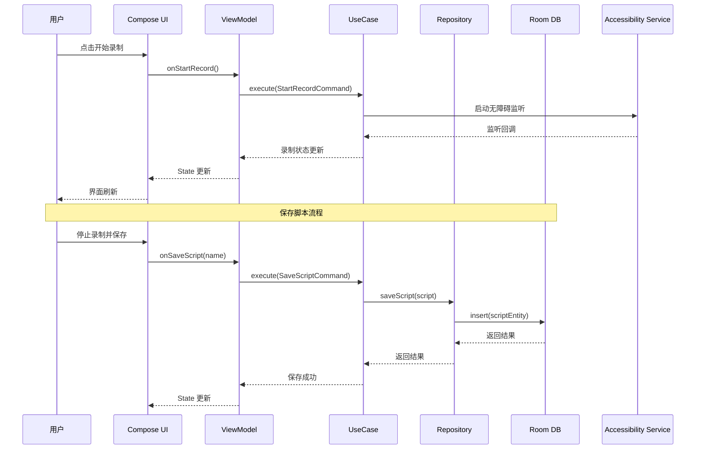

### 5.3 核心模块设计

#### 5.3.1 录制引擎 (Record Engine)

**职责**：监听用户操作，转换为标准动作数据结构

```
录制流程：
1. AccessibilityService 接收 onAccessibilityEvent
2. 解析事件类型（点击/滑动/滚动）
3. 提取坐标、时间、持续时间等信息
4. 封装为 TouchAction 对象
5. 加入当前录制的动作列表
6. 通过回调通知 UI 更新计数
```

#### 5.3.2 回放引擎 (Replay Engine)

**职责**：按顺序执行脚本中的动作，支持变速、循环

```
回放流程：
1. 从 Repository 加载 Script
2. 初始化 ActionExecutor
3. 按顺序遍历 Action 列表
4. 根据速度倍率计算延迟
5. 调用 AccessibilityService 执行手势
6. 实时回调进度状态
7. 支持暂停/停止控制
```

#### 5.3.3 悬浮窗管理 (Floating Manager)

**职责**：管理悬浮窗的显示、隐藏、拖拽、点击事件

```
悬浮窗状态：
- 收起状态：小圆点，显示录制/回放状态
- 展开状态：完整控制面板（开始/暂停/停止/设置）
- 拖拽移动：支持拖拽到屏幕任意位置
- 边缘吸附：自动吸附到屏幕左右边缘
```

#### 5.3.4 脚本编辑引擎 (Script Editor Engine)

**职责**：提供脚本动作的编辑能力，包括增删改查、排序、撤销重做等

```
编辑引擎核心能力：
1. 动作管理
   - 新增动作（点击/长按/滑动/等待）
   - 删除动作（单个/批量）
   - 修改动作属性（坐标、时间、类型）
   - 调整动作顺序（拖拽排序）
   
2. 撤销重做系统
   - 维护编辑历史栈
   - 支持多级撤销（默认50步）
   - 支持重做恢复
   - 编辑历史持久化（可选）

3. 坐标拾取
   - 截图展示
   - 点击选点
   - 坐标实时预览
   - 支持缩放精确定位

4. 编辑验证
   - 坐标合法性校验（屏幕范围内）
   - 时间顺序校验
   - 动作完整性检查
   - 保存前自动校验

5. 单步预览
   - 执行单个动作验证效果
   - 支持从任意位置开始预览
   - 预览不影响编辑状态
```

### 5.4 数据模型设计

#### 5.4.1 Script（脚本）

```kotlin
data class Script(
    val id: Long,                // 脚本ID
    val name: String,            // 脚本名称
    val description: String,     // 脚本描述
    val createTime: Long,        // 创建时间
    val updateTime: Long,        // 更新时间
    val duration: Long,          // 总时长（毫秒）
    val actionCount: Int,        // 操作数量
    val actions: List<TouchAction>, // 操作列表
    val thumbnail: String?       // 缩略图路径
)
```

#### 5.4.2 TouchAction（触控动作）

```kotlin
data class TouchAction(
    val id: String,              // 动作唯一ID
    val type: ActionType,        // 动作类型
    val startTime: Long,         // 相对开始时间（毫秒）
    val duration: Long,          // 持续时间（毫秒）
    val startX: Float,           // 起始X坐标
    val startY: Float,           // 起始Y坐标
    val endX: Float? = null,     // 结束X坐标（滑动时）
    val endY: Float? = null,     // 结束Y坐标（滑动时）
    val pressure: Float? = null, // 压力值
    val pathPoints: List<Point>? = null, // 路径点（复杂手势）
    val remark: String? = null   // 动作备注
)

enum class ActionType {
    CLICK,           // 点击
    LONG_PRESS,      // 长按
    SWIPE_UP,        // 上滑
    SWIPE_DOWN,      // 下滑
    SWIPE_LEFT,      // 左滑
    SWIPE_RIGHT,     // 右滑
    DRAG,            // 拖拽
    GESTURE,         // 复杂手势
    WAIT             // 等待（手动插入）
}
```

### 5.5 数据库设计

#### 5.5.1 数据库选型

| 选型 | 说明 |
|------|------|
| **数据库引擎** | SQLite（Android原生） |
| **ORM框架** | Room 2.6+（Jetpack官方） |
| **数据库版本** | v1.0（初始版本） |
| **迁移策略** | 增量迁移 + 版本号管理 |

#### 5.5.2 数据库表结构

##### scripts 表（脚本表）

| 字段名 | 类型 | 约束 | 说明 |
|--------|------|------|------|
| `id` | INTEGER | PRIMARY KEY AUTOINCREMENT | 脚本ID |
| `name` | TEXT | NOT NULL | 脚本名称 |
| `description` | TEXT | - | 脚本描述 |
| `duration` | INTEGER | NOT NULL DEFAULT 0 | 总时长（毫秒） |
| `action_count` | INTEGER | NOT NULL DEFAULT 0 | 操作数量 |
| `thumbnail_path` | TEXT | - | 缩略图路径 |
| `category` | TEXT | DEFAULT 'default' | 分类/文件夹 |
| `is_favorite` | INTEGER | DEFAULT 0 | 是否收藏（0/1） |
| `create_time` | INTEGER | NOT NULL | 创建时间戳 |
| `update_time` | INTEGER | NOT NULL | 更新时间戳 |
| `version` | INTEGER | DEFAULT 1 | 脚本格式版本 |

**索引**：
- `idx_scripts_name`：name 字段索引（搜索用）
- `idx_scripts_create_time`：create_time 字段索引（排序用）
- `idx_scripts_category`：category 字段索引（分类筛选用）

##### actions 表（动作表）

| 字段名 | 类型 | 约束 | 说明 |
|--------|------|------|------|
| `id` | TEXT | PRIMARY KEY | 动作唯一ID（UUID） |
| `script_id` | INTEGER | NOT NULL, FOREIGN KEY | 所属脚本ID |
| `action_index` | INTEGER | NOT NULL | 动作序号（排序用） |
| `type` | TEXT | NOT NULL | 动作类型（CLICK/SWIPE等） |
| `start_time` | INTEGER | NOT NULL | 相对开始时间（毫秒） |
| `duration` | INTEGER | NOT NULL DEFAULT 0 | 持续时间（毫秒） |
| `start_x` | REAL | NOT NULL | 起始X坐标 |
| `start_y` | REAL | NOT NULL | 起始Y坐标 |
| `end_x` | REAL | - | 结束X坐标（滑动时） |
| `end_y` | REAL | - | 结束Y坐标（滑动时） |
| `pressure` | REAL | - | 压力值 |
| `path_points` | TEXT | - | 路径点JSON（复杂手势） |
| `remark` | TEXT | - | 动作备注 |

**索引**：
- `idx_actions_script_id`：script_id 字段索引（查询脚本动作列表）
- `idx_actions_script_index`：(script_id, action_index) 联合索引（按顺序查询）

##### settings 表（设置表）

| 字段名 | 类型 | 约束 | 说明 |
|--------|------|------|------|
| `key` | TEXT | PRIMARY KEY | 设置项键名 |
| `value` | TEXT | - | 设置项值 |
| `value_type` | TEXT | NOT NULL | 值类型（string/int/bool/float） |
| `update_time` | INTEGER | NOT NULL | 更新时间戳 |

**预置设置项**：
- `default_replay_speed`：默认回放速度（默认1.0）
- `default_loop_count`：默认循环次数（默认1）
- `default_loop_interval`：默认循环间隔（默认0）
- `floating_size`：悬浮窗大小（默认40dp）
- `floating_opacity`：悬浮窗透明度（默认1.0）
- `vibration_enabled`：震动反馈开关（默认true）
- `sound_enabled`：声音反馈开关（默认false）
- `keep_screen_on`：录制时保持亮屏（默认true）
- `auto_start_record`：悬浮窗显示后自动开始录制（默认false）

#### 5.5.3 数据库关系图

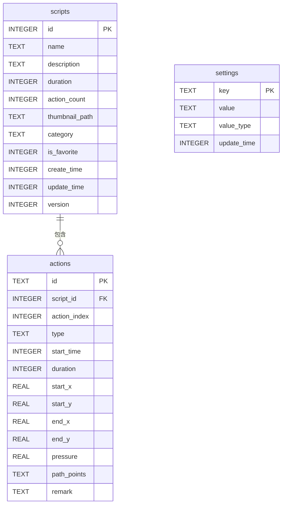

#### 5.5.4 数据库版本管理

**版本迁移策略**：
- 每次数据库结构变更，版本号 +1
- 实现 Migration 类定义迁移逻辑
- 支持从任意旧版本升级到最新版本

**版本历史**：
| 版本号 | 发布版本 | 变更内容 |
|--------|----------|----------|
| v1 | v1.0 | 初始版本：scripts、actions、settings 表 |

#### 5.5.5 数据备份与恢复

**备份策略**：
- 脚本数据自动备份到本地文件（JSON格式）
- 支持手动导出全部脚本为备份文件
- 支持从备份文件恢复脚本数据

**备份内容**：
- 所有脚本及其动作数据
- 用户设置配置
- 不包含缩略图（可重新生成）

---

## 6. 界面主题与配色设计

### 6.1 设计风格

**设计语言**：Material Design 3 (Material You)
**风格定位**：科技感、简洁、专业、高效
**目标感受**：可靠、强大、易用

### 6.2 配色方案

#### 6.2.1 主色调

| 颜色名称 | 色值 | 用途 |
|----------|------|------|
| **主色 Primary** | `#6366F1` (靛蓝) | 主要按钮、选中状态、品牌色 |
| **主色变体 Primary Variant** | `#4F46E5` | 按下状态、深色区域 |
| **次色 Secondary** | `#10B981` (翠绿) | 成功状态、录制中指示 |
| **次色变体 Secondary Variant** | `#059669` | 成功状态深色 |
| **警告色 Warning** | `#F59E0B` (琥珀) | 暂停状态、警告提示 |
| **错误色 Error** | `#EF4444` (红色) | 停止、错误、删除 |

#### 6.2.2 中性色

| 颜色名称 | 色值 | 用途 |
|----------|------|------|
| **背景 Background** | `#FFFFFF` | 页面背景（浅色模式） |
| **背景 Background Dark** | `#0F172A` | 页面背景（深色模式） |
| **表面 Surface** | `#F8FAFC` | 卡片、列表背景 |
| **表面 Surface Dark** | `#1E293B` | 卡片、列表背景（深色） |
| **主文字 On Background** | `#0F172A` | 主要文字 |
| **主文字 On Background Dark** | `#F1F5F9` | 主要文字（深色） |
| **次文字 Secondary Text** | `#64748B` | 次要文字、说明文字 |
| **分割线 Divider** | `#E2E8F0` | 分割线、边框 |

#### 6.2.3 功能色

| 颜色名称 | 色值 | 用途 |
|----------|------|------|
| **录制中** | `#EF4444` | 录制状态指示、悬浮窗录制态 |
| **回放中** | `#6366F1` | 回放状态指示 |
| **暂停中** | `#F59E0B` | 暂停状态指示 |
| **空闲** | `#10B981` | 就绪、空闲状态 |

### 6.3 字体设计

| 层级 | 字号 | 字重 | 用途 |
|------|------|------|------|
| **Display Large** | 32sp | Bold | 大标题（欢迎页等） |
| **Headline Medium** | 24sp | SemiBold | 页面标题 |
| **Title Large** | 20sp | SemiBold | 卡片标题 |
| **Title Medium** | 16sp | Medium | 列表项标题 |
| **Body Large** | 16sp | Regular | 正文内容 |
| **Body Medium** | 14sp | Regular | 次要内容 |
| **Label Large** | 14sp | Medium | 按钮文字 |
| **Label Small** | 12sp | Regular | 标签、说明文字 |

**字体**：默认使用系统字体（中文：思源黑体 / 英文：Roboto）

### 6.4 圆角与间距

| 元素 | 数值 |
|------|------|
| **卡片圆角** | 16dp |
| **按钮圆角** | 12dp |
| **输入框圆角** | 12dp |
| **悬浮窗圆角** | 20dp |
| **小图标圆角** | 8dp |
| **页面水平边距** | 20dp |
| **卡片内边距** | 16dp |
| **列表项间距** | 12dp |

### 6.5 主题色板预览

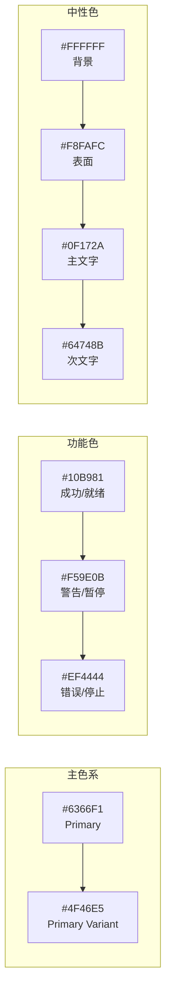

---

## 7. 业务逻辑设计

### 7.1 状态机设计

#### 7.1.1 录制状态机

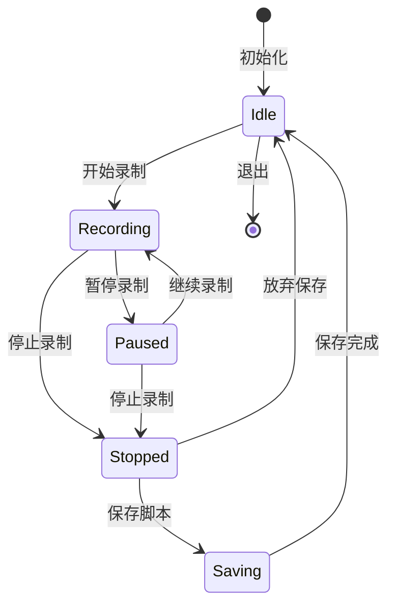

#### 7.1.2 回放状态机

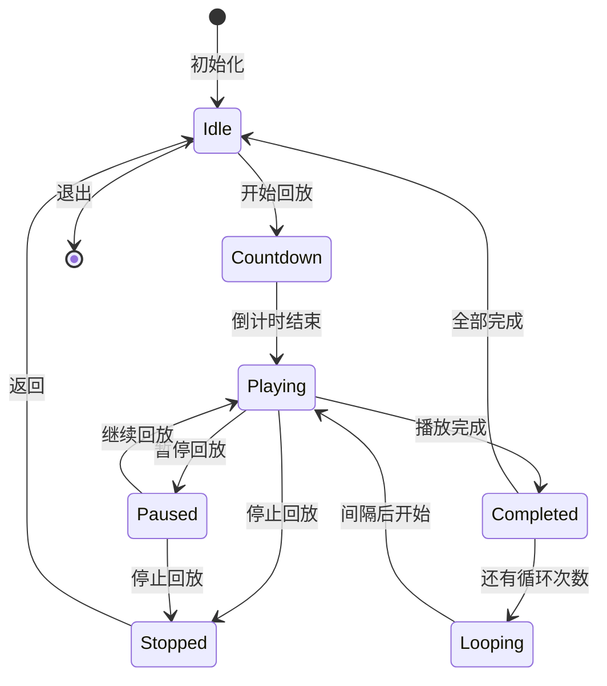

#### 7.1.3 编辑状态机

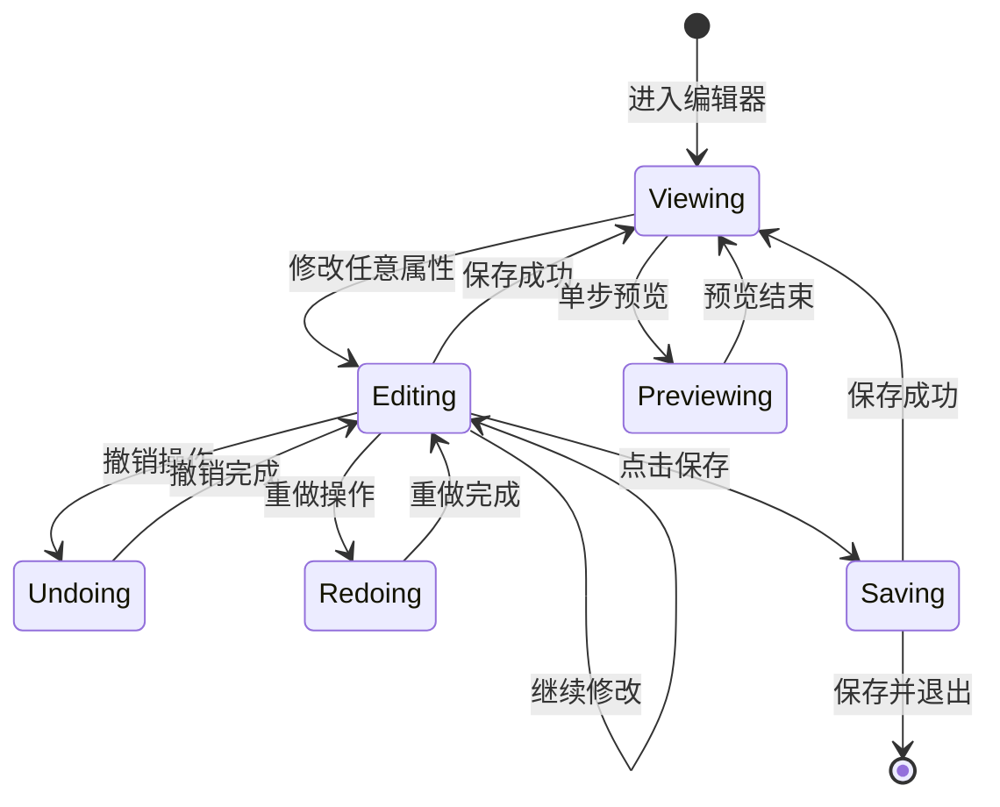

### 7.2 核心业务流程

#### 7.2.1 录制业务流程

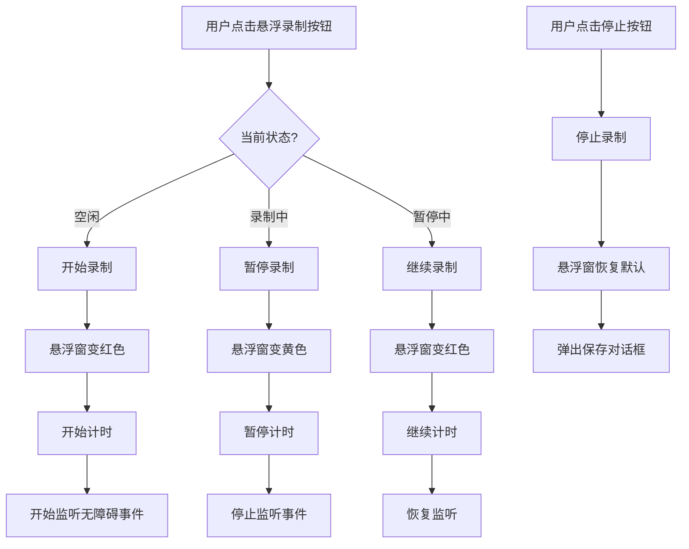

#### 7.2.2 回放业务流程

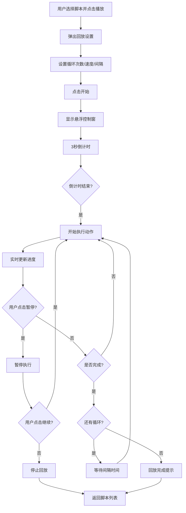

#### 7.2.3 编辑业务流程

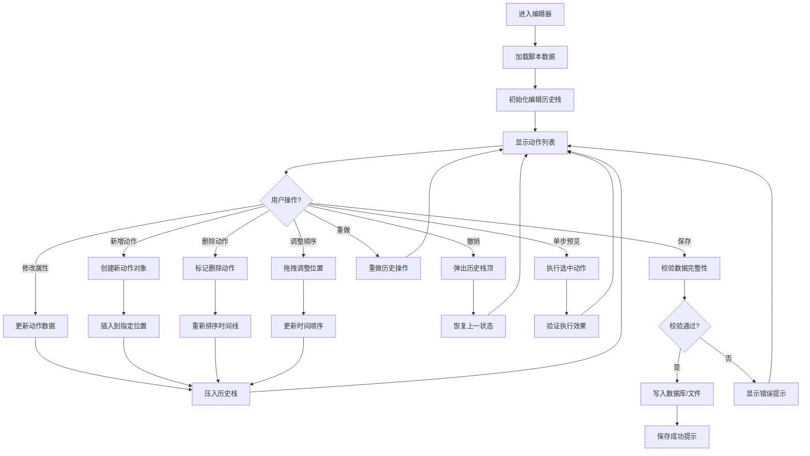

---

## 8. 测试设计

### 8.1 测试策略

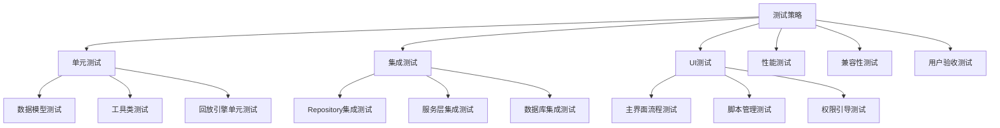

### 8.2 测试用例设计

#### 8.2.1 功能测试用例

| 测试模块 | 用例ID | 测试场景 | 前置条件 | 预期结果 | 优先级 |
|----------|--------|----------|----------|----------|--------|
| 录制功能 | TC-R-001 | 正常录制点击操作 | 无障碍权限已开启 | 成功录制点击坐标 | P0 |
| 录制功能 | TC-R-002 | 录制滑动操作 | 无障碍权限已开启 | 成功录制滑动路径 | P0 |
| 录制功能 | TC-R-003 | 暂停后继续录制 | 正在录制中 | 暂停后可继续，时间正确 | P1 |
| 录制功能 | TC-R-004 | 录制时长准确性 | 正常录制 | 实际时长与记录误差<100ms | P1 |
| 回放功能 | TC-P-001 | 单次回放脚本 | 已有保存的脚本 | 准确回放所有操作 | P0 |
| 回放功能 | TC-P-002 | 循环回放N次 | 设置循环次数 | 准确循环N次后停止 | P0 |
| 回放功能 | TC-P-003 | 倍速回放 | 设置2倍速 | 回放时间约为原时长1/2 | P1 |
| 回放功能 | TC-P-004 | 回放中暂停继续 | 正在回放 | 暂停后可继续执行 | P1 |
| 脚本管理 | TC-S-001 | 保存新脚本 | 完成录制 | 脚本出现在列表中 | P0 |
| 脚本管理 | TC-S-002 | 删除脚本 | 已有脚本 | 脚本从列表移除 | P0 |
| 脚本管理 | TC-S-003 | 重命名脚本 | 已有脚本 | 名称更新成功 | P1 |
| 脚本管理 | TC-S-004 | 导出脚本 | 已有脚本 | 生成JSON文件 | P1 |
| 脚本编辑 | TC-E-001 | 进入编辑器 | 已有脚本 | 成功加载动作列表 | P0 |
| 脚本编辑 | TC-E-002 | 修改点击坐标 | 选中点击动作 | 坐标值更新并保存 | P0 |
| 脚本编辑 | TC-E-003 | 修改动作时间 | 选中任意动作 | 开始时间和持续时间更新 | P0 |
| 脚本编辑 | TC-E-004 | 新增点击动作 | 编辑模式 | 在指定位置插入新点击动作 | P0 |
| 脚本编辑 | TC-E-005 | 新增等待动作 | 编辑模式 | 插入指定时长的等待 | P0 |
| 脚本编辑 | TC-E-006 | 删除单个动作 | 选中动作 | 动作被移除，后续动作时间重排 | P0 |
| 脚本编辑 | TC-E-007 | 拖拽调整顺序 | 长按动作项 | 动作顺序调整正确 | P1 |
| 脚本编辑 | TC-E-008 | 撤销操作 | 执行编辑操作后 | 成功撤销上一步 | P1 |
| 脚本编辑 | TC-E-009 | 重做操作 | 撤销后 | 成功重做撤销的操作 | P1 |
| 脚本编辑 | TC-E-010 | 坐标拾取 | 点击拾取按钮 | 跳转截图选点，返回坐标正确 | P1 |
| 脚本编辑 | TC-E-011 | 单步预览 | 选中动作 | 准确执行单步动作 | P1 |
| 脚本编辑 | TC-E-012 | 保存编辑 | 修改完成后 | 脚本保存成功，回放正确 | P0 |
| 脚本编辑 | TC-E-013 | 另存为新脚本 | 修改完成后 | 生成新脚本，原脚本不变 | P1 |
| 脚本编辑 | TC-E-014 | 批量删除动作 | 多选动作 | 批量删除成功 | P2 |
| 脚本编辑 | TC-E-015 | 滑动路径编辑 | 选中滑动动作 | 可调整滑动路径点 | P2 |
| 悬浮窗 | TC-F-001 | 悬浮窗显示 | 悬浮窗权限已开 | 悬浮窗正常显示 | P0 |
| 悬浮窗 | TC-F-002 | 悬浮窗拖拽 | 悬浮窗显示中 | 可拖拽到任意位置 | P1 |
| 悬浮窗 | TC-F-003 | 边缘吸附 | 拖拽结束 | 自动吸附到左右边缘 | P2 |

#### 8.2.2 性能测试用例

| 测试项 | 测试方法 | 指标要求 |
|--------|----------|----------|
| 冷启动时间 | 多次冷启动取平均 | < 1000ms |
| 热启动时间 | 从后台切回 | < 200ms |
| 内存占用 | 录制30分钟后 | < 100MB |
| CPU占用 | 录制/回放时 | < 5% |
| 电量消耗 | 连续录制1小时 | < 5% |
| 脚本加载 | 1000步脚本加载 | < 500ms |
| 悬浮窗响应 | 点击悬浮窗到响应 | < 100ms |

#### 8.2.3 兼容性测试矩阵

| Android版本 | 测试机型 | 分辨率 | 处理器 |
|-------------|----------|--------|--------|
| Android 8.0 | 小米6 | 1920x1080 | 骁龙835 |
| Android 9 | 华为Mate 20 | 2244x1080 | 麒麟980 |
| Android 10 | OPPO Reno3 | 2400x1080 | 天玑1000L |
| Android 11 | vivo X60 | 2376x1080 | 骁龙870 |
| Android 12 | 小米12 | 2400x1080 | 骁龙8 Gen1 |
| Android 13 | 华为Mate 50 | 2700x1224 | 骁龙8+ Gen1 |
| Android 14 | 小米14 | 2670x1200 | 骁龙8 Gen3 |

### 8.3 测试工具

| 测试类型 | 工具 | 说明 |
|----------|------|------|
| 单元测试 | JUnit 5 + MockK | Kotlin 标准测试框架 |
| UI测试 | Espresso + Compose Test | Jetpack Compose UI测试 |
| 性能测试 | Android Profiler | 内存、CPU、电量分析 |
| 自动化测试 | UI Automator | 跨应用自动化测试 |
| 兼容性测试 | Firebase Test Lab | 云测平台多机型测试 |
| 崩溃监控 | Bugly / Sentry | 线上崩溃收集分析 |

---

## 9. 版权与授权设计

### 9.1 软件许可协议

#### 9.1.1 用户协议 (EULA)

**核心条款**：

1. **使用许可**：授予用户非排他性、不可转让的使用许可
2. **使用限制**：
   - 不得用于非法用途
   - 不得用于恶意攻击、破坏他人系统
   - 不得用于批量刷量、作弊等违规行为
   - 不得逆向工程、反编译本软件
3. **免责声明**：
   - 用户因使用本软件造成的任何损失，软件开发者不承担责任
   - 因系统升级、厂商定制导致的功能失效不承担责任
4. **隐私保护**：
   - 所有录制数据仅保存在本地
   - 不上传任何用户操作数据
   - 不收集个人隐私信息

#### 9.1.2 隐私政策

**数据收集说明**：

| 数据类型 | 是否收集 | 用途 | 存储位置 |
|----------|----------|------|----------|
| 脚本文件 | 否 | 用户操作记录 | 本地存储 |
| 设备信息 | 是（匿名） | 兼容性分析、崩溃排查 | 云端（匿名化） |
| 使用统计 | 是（匿名） | 功能使用频率分析 | 云端（匿名化） |
| 崩溃日志 | 是（匿名） | Bug修复 | 云端（匿名化） |
| 个人信息 | 否 | - | - |
| 位置信息 | 否 | - | - |
| 通讯录 | 否 | - | - |

### 9.2 开源许可

#### 9.2.1 使用的开源库

| 库名 | 许可证 | 用途 |
|------|--------|------|
| Kotlin Standard Library | Apache 2.0 | 开发语言 |
| Jetpack Compose | Apache 2.0 | UI框架 |
| Room | Apache 2.0 | 本地数据库 |
| Navigation Compose | Apache 2.0 | 页面导航 |
| Material Design 3 | Apache 2.0 | 设计组件 |
| Coroutines | Apache 2.0 | 异步编程 |
| Gson / Moshi | Apache 2.0 | JSON解析 |
| Coil | Apache 2.0 | 图片加载 |
| Timber | Apache 2.0 | 日志 |

#### 9.2.2 本软件许可

**建议采用**：**GPL v3** 或 **商业闭源**

| 许可方式 | 优点 | 缺点 | 适用场景 |
|----------|------|------|----------|
| **GPL v3** | 开源社区贡献、代码透明 | 商业应用需开源、保护弱 | 个人开发者、社区项目 |
| **MIT/Apache** | 宽松、商业友好 | 他人可闭源商用 | 技术分享、生态建设 |
| **商业闭源** | 完全控制、可商业化 | 无社区贡献、信任成本高 | 商业化产品、付费软件 |

**推荐方案**：核心功能闭源 + 部分工具类开源

### 9.3 版权声明

```
Copyright © 2026 AutoTouch Pro. All rights reserved.

本软件受著作权法和国际著作权条约以及其他知识产权法和条约的保护。
未经授权，不得复制、分发、修改本软件的任何部分。
```

### 9.4 商标设计

- **应用名称**：AutoTouch Pro（触控精灵专业版）
- **Logo设计**：抽象化的手指触控图标 + 循环箭头
- **品牌色**：靛蓝色 (#6366F1)
- **Slogan**：解放双手，触控随心

---

## 10. 开发方案设计

### 10.1 技术栈选型

| 类别 | 技术选型 | 版本 | 说明 |
|------|----------|------|------|
| **开发语言** | Kotlin | 1.9+ | Android 官方推荐语言 |
| **UI框架** | Jetpack Compose | 1.6+ | 声明式UI，开发效率高 |
| **架构模式** | MVVM + Clean Architecture | - | 清晰分层，易测试 |
| **异步编程** | Kotlin Coroutines + Flow | 1.8+ | 协程，响应式编程 |
| **依赖注入** | Hilt | 2.50+ | Google 官方 DI 框架 |
| **本地数据库** | Room | 2.6+ | SQLite ORM |
| **导航** | Navigation Compose | 2.7+ | Compose 导航组件 |
| **JSON解析** | Moshi | 1.15+ | 高性能 JSON 解析 |
| **图片加载** | Coil | 2.5+ | Compose 友好的图片库 |
| **日志** | Timber | 5.0+ | 轻量级日志框架 |
| **测试** | JUnit 5 + MockK + Espresso | - | 完整测试体系 |

### 10.2 开发环境

| 工具 | 版本要求 |
|------|----------|
| Android Studio | Iguana (2023.2.1) 或更高 |
| JDK | JDK 17 |
| Gradle | 8.5+ |
| Android Gradle Plugin | 8.3+ |
| Kotlin Gradle Plugin | 1.9.20+ |

### 10.3 开发阶段规划

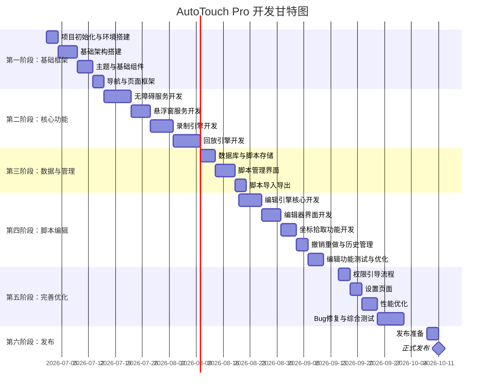

### 10.4 里程碑定义

| 里程碑 | 时间节点 | 交付物 | 验收标准 |
|--------|----------|--------|----------|
| **M1：框架完成** | 第1周结束 | 可运行的App框架、基础页面 | 页面可跳转、主题统一 |
| **M2：录制可用** | 第3周结束 | 完整录制功能 | 可正常录制点击和滑动 |
| **M3：回放可用** | 第4周结束 | 完整回放功能 | 可准确回放录制的脚本 |
| **M4：管理完善** | 第6周结束 | 脚本管理完整功能 | 增删改查导入导出 |
| **M5：编辑可用** | 第8周结束 | 脚本编辑核心功能 | 可增删改动作、调整顺序 |
| **M6：编辑完善** | 第9周结束 | 完整编辑功能 | 坐标拾取、撤销重做、单步预览 |
| **M7：Beta版本** | 第13周结束 | Beta测试包 | 全部功能稳定可用 |
| **M8：正式发布** | 第15周结束 | 正式发布版本 | 通过所有测试用例 |

### 10.5 风险与应对

| 风险 | 影响 | 概率 | 应对措施 |
|------|------|------|----------|
| 不同厂商ROM无障碍服务差异 | 高 | 高 | 多机型测试、适配各厂商 |
| 系统版本升级导致API变更 | 中 | 中 | 持续关注Android新版本 |
| 后台服务被系统杀死 | 高 | 高 | 前台服务、电池优化白名单 |
| 悬浮窗权限各厂商差异 | 中 | 高 | 适配各厂商悬浮窗跳转 |
| 回放准确率不达标 | 高 | 中 | 优化手势执行算法 |
| 开发周期延期 | 中 | 中 | 优先级管理、分阶段交付 |

---

## 11. 交互设计

### 11.1 页面交互设计

#### 11.1.1 首页（脚本列表）

**页面结构**：
```
┌─────────────────────────────┐
│  AutoTouch Pro        ⚙️    │  ← 顶部标题栏
├─────────────────────────────┤
│  ┌───────────────────────┐  │
│  │  🎬  快速录制          │  │  ← 快速录制卡片
│  │  点击开始录制操作       │  │
│  └───────────────────────┘  │
│                             │
│  我的脚本 (12)              │  ← 分类标题
│  ┌───────────────────────┐  │
│  │ 📋 每日签到脚本        │  │
│  │ 15步 · 32秒 · 3天前   │  │  ← 脚本列表项
│  └───────────────────────┘  │
│  ┌───────────────────────┐  │
│  │ 📋 自动刷视频          │  │
│  │ 8步 · 1分20秒 · 1周前 │  │
│  └───────────────────────┘  │
│                             │
│         [+ 新建脚本]        │  ← 底部浮动按钮
└─────────────────────────────┘
```

**交互细节**：
- 点击快速录制卡片 → 直接启动悬浮窗并开始录制
- 点击脚本项 → 进入脚本详情页
- 长按脚本项 → 弹出操作菜单（播放/编辑/重命名/删除/分享）
- 左滑脚本项 → 显示删除按钮
- 点击右下角 + 按钮 → 弹出创建菜单（录制新脚本/导入脚本）

#### 11.1.2 脚本详情页

**页面结构**：
```
┌─────────────────────────────┐
│  ←  每日签到脚本       ⋮    │
├─────────────────────────────┤
│  ┌───────────────────────┐  │
│  │  ▶️  开始回放           │  │  ← 大播放按钮
│  │  循环 1次  速度 1.0x   │  │
│  └───────────────────────┘  │
│                             │
│  操作步骤 (15步)            │
│  ┌───────────────────────┐  │
│  │ 1. 点击 (540, 1200)   │  │  ← 步骤列表
│  │    00:01  点击         │  │
│  ├───────────────────────┤  │
│  │ 2. 等待 2.5s          │  │
│  │    00:03  等待         │  │
│  ├───────────────────────┤  │
│  │ 3. 上滑 (540,1600→... │  │
│  │    00:05  滑动         │  │
│  └───────────────────────┘  │
│                             │
│  [编辑]  [导出]  [分享]     │  ← 底部操作栏
└─────────────────────────────┘
```

#### 11.1.3 脚本编辑器页面

**页面结构**：
```
┌─────────────────────────────┐
│ ←  编辑脚本       ↶ ↷  ⋮   │  ← 顶部工具栏（返回/撤销/重做/更多）
│  每日签到脚本 (15步)        │
├─────────────────────────────┤
│  ┌───────────────────────┐  │
│  │  总时长: 32秒          │  │  ← 脚本信息栏
│  │  操作数: 15            │  │
│  └───────────────────────┘  │
│                             │
│  1. 点击                    │  ← 动作列表
│  ┌───────────────────────┐  │
│  │ 📍 (540, 1200)        │  │
│  │ ⏱️ 00:01  持续: 0.1s  │  │
│  │    [坐标] [时间] [删除]│  │  ← 操作按钮
│  └───────────────────────┘  │
│                             │
│  2. 等待                    │
│  ┌───────────────────────┐  │
│  │ ⏱️ 等待 2.5 秒        │  │
│  │    [调整时长] [删除]   │  │
│  └───────────────────────┘  │
│                             │
│  3. 上滑                    │
│  ┌───────────────────────┐  │
│  │ 📍 (540,1600)→(540,800)│ │
│  │ ⏱️ 00:05  持续: 0.3s  │  │
│  │    [坐标] [路径] [删除]│  │
│  └───────────────────────┘  │
│                             │
│         [+ 添加动作]        │  ← 添加动作按钮
├─────────────────────────────┤
│  [预览单步]  [保存]  [另存为]│  ← 底部操作栏
└─────────────────────────────┘
```

**交互细节**：
- 点击动作项 → 展开/收起详情面板
- 长按动作项 → 进入拖拽排序模式
- 左滑动作项 → 显示删除按钮
- 点击 [坐标] 按钮 → 弹出坐标输入框或跳转坐标拾取
- 点击 [时间] 按钮 → 弹出时间调整滑块
- 点击 [+ 添加动作] → 弹出动作类型选择菜单
- 点击撤销 → 撤销上一步编辑操作
- 点击重做 → 重做撤销的操作
- 点击 [预览单步] → 执行当前选中的动作进行预览
- 点击 [保存] → 覆盖保存原脚本
- 点击 [另存为] → 保存为新脚本

#### 11.1.4 坐标拾取页面

**页面结构**：
```
┌─────────────────────────────┐
│ ←  选择坐标           ✓ 确定 │
├─────────────────────────────┤
│                             │
│     ┌─────────────────┐     │
│     │                 │     │
│     │   屏幕截图       │     │  ← 截图展示区域
│     │                 │     │
│     │       ✛         │     │  ← 选点十字光标
│     │                 │     │
│     └─────────────────┘     │
│                             │
│  ┌───────────────────────┐  │
│  │  X: 540    Y: 1200    │  │  ← 坐标实时显示
│  │  [-] [123] [+]  精度  │  │  ← 微调按钮
│  └───────────────────────┘  │
│                             │
│  [+ 放大]  [- 缩小]  [重置] │  ← 缩放控制
└─────────────────────────────┘
```

**交互细节**：
- 点击截图任意位置 → 光标移动到该位置，坐标实时更新
- 拖拽光标 → 精确定位坐标
- 双指缩放 → 放大/缩小截图（最大4倍）
- 点击 +/- 按钮 → 微调坐标位置（1像素/次）
- 长按 +/- 按钮 → 连续微调
- 点击 [确定] → 确认坐标并返回编辑器
- 点击 [重置] → 恢复原始位置和缩放比例

#### 11.1.5 权限引导页

**页面结构**：
```
┌─────────────────────────────┐
│                             │
│        🎯 权限引导          │
│    开启以下权限以使用全部功能  │
│                             │
├─────────────────────────────┤
│  ✅ 无障碍服务               │  ← 已完成状态
│  用于监听和执行操作          │
│  [已开启]                   │
├─────────────────────────────┤
│  ⚪ 悬浮窗权限               │  ← 待开启状态
│  用于显示悬浮控制窗          │
│  [去开启] →                 │
├─────────────────────────────┤
│  ⚪ 存储权限                 │
│  用于保存脚本文件            │
│  [去开启] →                 │
├─────────────────────────────┤
│                             │
│  全部权限开启后即可开始使用   │
│         [进入应用]          │  ← 禁用/启用状态
└─────────────────────────────┘
```

### 11.2 悬浮窗交互设计

#### 11.2.1 悬浮窗状态

**收起状态（小圆点）**：
```
   ┌─────┐
   │  ●  │    ← 小圆点，直径 40dp
   └─────┘
   
   颜色随状态变化：
   - 空闲：靛蓝色
   - 录制中：红色 + 呼吸动画
   - 回放中：靛蓝色 + 旋转动画
   - 暂停中：黄色
```

**展开状态（控制面板）**：
```
   ┌─────────────────┐
   │  ⏸️  ⏹️  ⚙️  ✕  │    ← 控制按钮栏
   ├─────────────────┤
   │   录制中 00:32  │    ← 状态与计时
   │   已录制 8 步   │
   └─────────────────┘
   
   宽度：200dp，高度：自适应
```

#### 11.2.2 悬浮窗手势交互

| 手势 | 行为 | 反馈 |
|------|------|------|
| 单击圆点 | 展开/收起控制面板 | 平滑展开动画 |
| 长按拖拽 | 移动悬浮窗位置 | 跟随手指移动 |
| 拖拽释放 | 吸附到最近边缘 | 平滑吸附动画 |
| 双击圆点 | 快速开始/停止录制 | 震动反馈 |
| 上滑 | 打开设置面板 | 面板从底部滑出 |

### 11.3 动效设计

#### 11.3.1 页面转场

| 转场类型 | 动画效果 | 时长 |
|----------|----------|------|
| 进入新页面 | 右侧滑入 + 淡入 | 300ms |
| 返回上一页 | 左侧滑出 + 淡出 | 250ms |
| 底部弹窗 | 底部滑入 + 淡入 | 250ms |
| 对话框 | 缩放 + 淡入 | 200ms |

#### 11.3.2 状态反馈

| 状态 | 动效 |
|------|------|
| 录制开始 | 悬浮窗红色扩散动画 + 震动反馈 |
| 录制中 | 红色呼吸动画（明暗交替） |
| 回放开始 | 3-2-1 倒计时动画 |
| 回放中 | 进度条平滑移动 |
| 操作成功 | 绿色对勾弹出动画 |
| 操作失败 | 红色抖动动画 |

### 11.4 反馈设计

#### 11.4.1 触觉反馈

| 场景 | 震动模式 |
|------|----------|
| 开始录制 | 短震 1 次 (30ms) |
| 停止录制 | 短震 2 次 |
| 回放开始 | 长震 1 次 (100ms) |
| 点击悬浮窗 | 极短震 (10ms) |
| 操作错误 | 长震 + 间隔 + 长震 |

#### 11.4.2 声音反馈（可选）

| 场景 | 音效 |
|------|------|
| 开始录制 | "咔" 快门声 |
| 停止录制 | "叮" 完成声 |
| 回放完成 | 提示音 |

---

## 12. 更新设计

### 12.1 版本管理策略

#### 12.1.1 版本号规范

采用 **语义化版本号 (Semantic Versioning)**：

```
主版本号.次版本号.修订号
示例：1.2.3
```

| 版本位 | 说明 | 变更时机 |
|--------|------|----------|
| **主版本号** | 重大功能更新、架构变更 | 不兼容的API修改、核心功能重构 |
| **次版本号** | 新功能、功能增强 | 向下兼容的功能性新增 |
| **修订号** | Bug修复、优化 | 向下兼容的问题修正 |

#### 12.1.2 发布渠道

| 渠道 | 用途 | 更新频率 |
|------|------|----------|
| **Alpha版** | 内部测试 | 每周1-2次 |
| **Beta版** | 小范围公测 | 每2-3周1次 |
| **正式版** | 全量发布 | 每月1次 |
| **热更新** | 紧急Bug修复 | 按需发布 |

### 12.2 更新机制设计

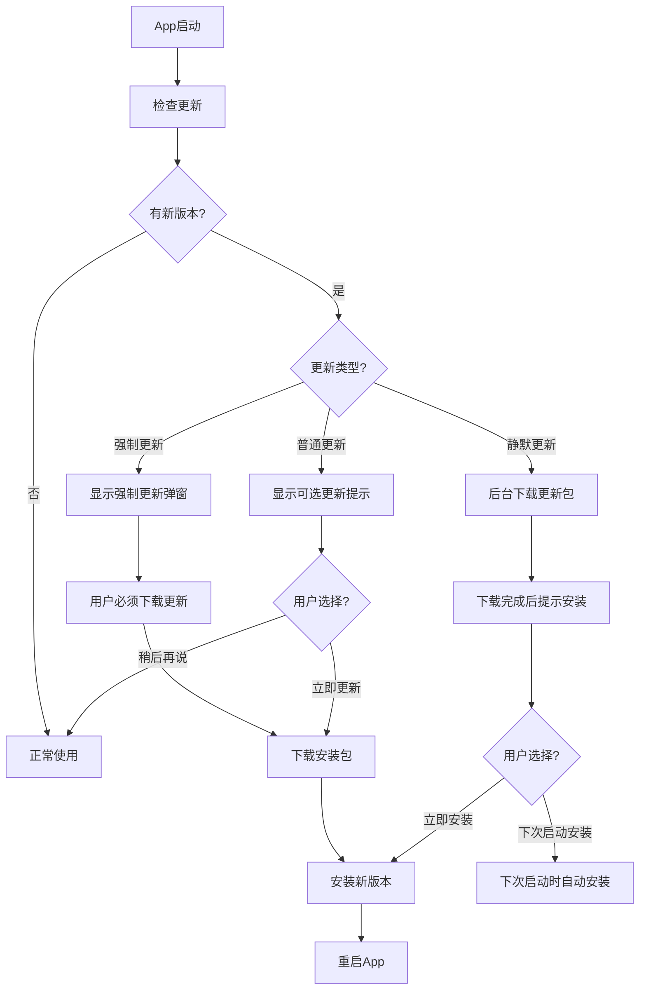

### 12.3 更新内容设计

#### 12.3.1 更新日志模板

```
【版本 1.2.0】2026-XX-XX

✨ 新功能
- 新增脚本编辑功能，支持可视化调整操作步骤
- 新增循环间隔设置，可自定义每次循环的等待时间
- 新增脚本分类文件夹，更好地管理大量脚本

🎨 优化
- 优化悬浮窗拖拽体验，更跟手
- 优化回放引擎，准确率提升至98%
- 优化启动速度，冷启动快30%

🐛 修复
- 修复部分机型录制滑动不完整的问题
- 修复Android 14上悬浮窗显示异常
- 修复若干已知Bug
```

#### 12.3.2 版本路线图

| 版本 | 计划时间 | 核心功能 |
|------|----------|----------|
| **v1.0** | 2026.10 | 基础录制回放、脚本管理、悬浮窗、基础编辑 |
| **v1.1** | 2026.11 | 高级编辑（坐标拾取、撤销重做、单步预览）、倍速回放、循环间隔 |
| **v1.2** | 2026.12 | 脚本分类、搜索、批量操作、时间轴视图 |
| **v1.3** | 2027.01 | 触发条件（定时/应用启动触发） |
| **v2.0** | 2027.02 | 图像识别点击、智能等待 |
| **v2.1** | 2027.03 | 脚本市场、社区分享 |
| **v2.2** | 2027.04 | 变量支持、条件判断、简单编程 |

### 12.4 灰度发布策略

#### 12.4.1 灰度比例

| 阶段 | 灰度比例 | 持续时间 | 目标 |
|------|----------|----------|------|
| 1% 灰度 | 1% 用户 | 1天 | 验证严重崩溃问题 |
| 5% 灰度 | 5% 用户 | 2天 | 验证核心功能稳定性 |
| 20% 灰度 | 20% 用户 | 2天 | 验证大规模兼容性 |
| 50% 灰度 | 50% 用户 | 2天 | 验证服务器承载 |
| 全量发布 | 100% 用户 | - | 正式发布 |

#### 12.4.2 灰度停止条件

- 崩溃率 > 0.5%
- 核心功能报错率 > 1%
- 用户反馈严重问题

---

## 13. 项目命名与包名设计

### 13.1 项目名称

#### 13.1.1 正式名称

| 名称类型 | 名称 | 说明 |
|----------|------|------|
| **英文名称** | AutoTouch Pro | 国际通用，专业版定位 |
| **中文名称** | 触控精灵专业版 | 国内市场，易于理解 |
| **简称** | AutoTouch | 日常提及、社区交流 |

#### 13.1.2 命名由来

- **Auto**：自动化、自动执行
- **Touch**：触控、触摸操作
- **Pro**：专业版，功能强大

组合含义：**专业的触控自动化工具**

#### 13.1.3 Slogan

- 主Slogan：**解放双手，触控随心**
- 副Slogan：**你的智能操作助手**
- 技术向：**Record Once, Play Forever**

### 13.2 包名设计

#### 13.2.1 应用包名

| 包名 | 说明 |
|------|------|
| **正式包名** | `com.autotouch.pro` | 标准反向域名格式 |
| **开发版包名** | `com.autotouch.pro.dev` | 开发调试用，可与正式版共存 |
| **测试版包名** | `com.autotouch.pro.beta` | Beta测试用 |

#### 13.2.2 命名规范

遵循 Android 官方包名命名规范：
- 全部小写
- 反向域名格式
- 不使用下划线（除特殊情况）
- 不使用数字开头

### 13.3 应用图标设计

#### 13.3.1 设计理念

- **核心元素**：手指触控 + 循环箭头
- **设计风格**：扁平化、渐变、现代感
- **品牌色**：靛蓝色渐变 (#6366F1 → #8B5CF6)

#### 13.3.2 图标规格

| 规格 | 尺寸 | 用途 |
|------|------|------|
| mdpi | 48x48px | 低密度屏幕 |
| hdpi | 72x72px | 中密度屏幕 |
| xhdpi | 96x96px | 高密度屏幕 |
| xxhdpi | 144x144px | 超高密度屏幕 |
| xxxhdpi | 192x192px | 超超高密度屏幕 |
| Google Play | 512x512px | 应用商店展示 |

### 13.4 项目目录命名

```
项目根目录：AutoTouchPro
├── app/                    # 主应用模块
├── core/                   # 核心模块（可复用）
├── feature/                # 功能模块
│   ├── record/             # 录制功能
│   ├── replay/             # 回放功能
│   ├── script/             # 脚本管理
│   └── settings/           # 设置功能
├── common/                 # 公共组件
└── docs/                   # 文档
```

### 13.5 命名规范

#### 13.5.1 类命名规范

| 类型 | 后缀 | 示例 |
|------|------|------|
| Activity | Activity | MainActivity |
| Fragment | Fragment | HomeFragment |
| ViewModel | ViewModel | ScriptListViewModel |
| Service | Service | FloatingWindowService |
| Repository | Repository | ScriptRepository |
| DAO | Dao | ScriptDao |
| UseCase | UseCase | ReplayScriptUseCase |
| Manager | Manager | RecordManager |
| 工具类 | Utils / Helper | PermissionUtils |

#### 13.5.2 资源命名规范

| 资源类型 | 前缀 | 示例 |
|----------|------|------|
| 布局文件 | `activity_` / `fragment_` / `item_` | `activity_main.xml` |
| 图片资源 | `ic_` (图标) / `img_` (图片) / `bg_` (背景) | `ic_record.png` |
| 字符串 | 按功能模块分类 | `record_start` |
| 颜色 | `color_` + 名称 | `color_primary` |
| 尺寸 | `dimen_` + 名称 | `dimen_card_radius` |

---

## 14. 安全设计

### 14.1 数据安全

#### 14.1.1 本地数据安全

| 安全项 | 措施 | 说明 |
|--------|------|------|
| **脚本文件** | 内部存储 + 可选加密 | 默认存储在应用私有目录，敏感脚本可加密 |
| **数据库** | SQLite + 应用沙箱 | 数据库文件位于应用私有目录，外部应用无法访问 |
| **设置数据** | SharedPreferences 私有模式 | MODE_PRIVATE，仅本应用可读写 |
| **缓存数据** | 定期清理 | 截图缓存、临时文件定期自动清理 |

#### 14.1.2 数据加密方案

**可选加密功能**（高级功能）：
- 加密算法：AES-256
- 密钥管理：Android Keystore 系统
- 加密范围：脚本动作数据、敏感设置
- 触发条件：用户设置密码后启用

### 14.2 权限安全

#### 14.2.1 最小权限原则

| 权限 | 是否必须 | 申请时机 | 用途说明 |
|------|----------|----------|----------|
| 无障碍服务 | 是 | 首次使用引导 | 核心功能必需，用于监听和执行操作 |
| 悬浮窗权限 | 是 | 首次使用引导 | 显示悬浮控制窗 |
| 存储权限 | 是 | 脚本导入导出时 | 仅在需要时申请 |
| 网络权限 | 是 | 首次启动 | 用于更新和匿名统计 |
| 相机权限 | 否 | 扫码功能使用时 | 可选功能，按需申请 |
| 位置权限 | 否 | 高级功能使用时 | 可选功能，按需申请 |
| 录音权限 | 否 | 语音功能使用时 | 未来扩展，暂不申请 |

#### 14.2.2 权限申请规范

- **按需申请**：非必须权限在使用对应功能时才申请
- **说明清晰**：申请权限时明确告知用户用途
- **拒绝处理**：权限被拒绝时提供替代方案或引导手动开启
- **状态检测**：每次使用功能前检测权限状态

### 14.3 防滥用设计

#### 14.3.1 使用限制

| 限制项 | 措施 | 目的 |
|--------|------|------|
| **前台服务通知** | 录制/回放时显示常驻通知 | 让用户知晓应用正在运行 |
| **悬浮窗可见** | 运行时悬浮窗始终可见 | 防止后台偷偷执行操作 |
| **停止快捷方式** | 通知栏一键停止、音量键停止 | 用户可随时快速终止 |
| **时长限制** | 单次回放最长24小时（可配置） | 防止无限运行消耗资源 |
| **循环次数限制** | 默认最大999次 | 防止误设置导致无限循环 |

#### 14.3.2 恶意使用防护

- **用户协议明确禁止**：EULA中明确禁止用于非法、恶意用途
- **使用提示**：首次使用时提示正当使用
- **异常检测**：检测到异常高频操作时提示用户
- **不提供隐藏功能**：不提供隐藏图标、后台静默运行等功能

### 14.4 隐私保护

#### 14.4.1 数据收集原则

| 数据类型 | 是否收集 | 收集方式 | 用途 | 存储位置 |
|----------|----------|----------|------|----------|
| 脚本内容 | 否 | - | - | 仅本地 |
| 操作内容 | 否 | - | - | 仅本地 |
| 设备型号 | 是（匿名） | 启动时上报 | 兼容性分析 | 云端 |
| 系统版本 | 是（匿名） | 启动时上报 | 兼容性分析 | 云端 |
| 功能使用统计 | 是（匿名） | 事件上报 | 产品优化 | 云端 |
| 崩溃日志 | 是（匿名） | 崩溃时上报 | Bug修复 | 云端 |
| 个人信息 | 否 | - | - | - |
| 位置信息 | 否 | - | - | - |
| 通讯录 | 否 | - | - | - |

#### 14.4.2 匿名化处理

- 设备标识：使用 Android ID 哈希，不收集真实设备ID
- 数据上报：不含任何可识别个人身份的信息
- 用户ID：随机生成匿名ID，不与真实身份关联
- 数据脱敏：日志中自动脱敏敏感信息

### 14.5 应用安全

#### 14.5.1 应用完整性

- **签名校验**：运行时校验应用签名，防止篡改
- **渠道校验**：验证应用来源渠道
- **完整性检查**：启动时检查核心文件完整性

#### 14.5.2 防调试与反编译

- **Debug检测**：检测是否处于调试模式，可选择退出
- **模拟器检测**：检测是否运行在模拟器中
- **Root检测**：检测设备是否Root，提示安全风险
- **代码混淆**：Release版本启用ProGuard/R8混淆

---

## 15. 错误处理与异常设计

### 15.1 错误码定义

#### 15.1.1 错误码规范

**错误码格式**：`E-模块-编号`
- 模块：REC（录制）、REP（回放）、SCR（脚本）、EDT（编辑）、PER（权限）、SYS（系统）
- 编号：3位数字，从001开始

#### 15.1.2 错误码列表

| 错误码 | 错误名称 | 级别 | 说明 | 处理方式 |
|--------|----------|------|------|----------|
| E-PER-001 | 无障碍权限未开启 | 严重 | 核心权限缺失 | 引导用户开启 |
| E-PER-002 | 悬浮窗权限未开启 | 严重 | 悬浮功能无法使用 | 引导用户开启 |
| E-PER-003 | 存储权限被拒绝 | 警告 | 无法读写文件 | 提示用户手动开启 |
| E-REC-001 | 录制启动失败 | 严重 | 无法开始录制 | 提示错误，检查权限 |
| E-REC-002 | 录制被中断 | 警告 | 录制过程异常中断 | 自动保存已录制内容 |
| E-REP-001 | 脚本加载失败 | 严重 | 无法加载脚本 | 提示脚本损坏 |
| E-REP-002 | 回放执行错误 | 警告 | 单步执行失败 | 跳过继续或停止 |
| E-REP-003 | 回放被系统中断 | 警告 | 系统原因导致中断 | 提示用户原因 |
| E-SCR-001 | 脚本保存失败 | 严重 | 无法保存脚本 | 提示存储空间不足 |
| E-SCR-002 | 脚本文件损坏 | 严重 | 脚本文件无法解析 | 提示损坏，建议删除 |
| E-SCR-003 | 脚本导入失败 | 警告 | 导入文件格式错误 | 提示文件格式不正确 |
| E-EDT-001 | 坐标超出范围 | 提示 | 坐标不在屏幕范围内 | 标红提示，禁止保存 |
| E-EDT-002 | 时间顺序错误 | 提示 | 动作时间顺序混乱 | 自动修正或提示 |
| E-SYS-001 | 内存不足 | 严重 | 系统内存不足 | 提示用户清理内存 |
| E-SYS-002 | 存储空间不足 | 警告 | 存储空间不足 | 提示清理存储空间 |
| E-SYS-003 | 系统版本不兼容 | 严重 | Android版本过低 | 提示最低版本要求 |

### 15.2 异常处理策略

#### 15.2.1 异常分级处理

| 异常级别 | 处理方式 | 示例 |
|----------|----------|------|
| **致命错误** | 弹出错误提示，终止操作，引导用户反馈 | 核心权限缺失、脚本完全损坏 |
| **严重错误** | 弹出提示，终止当前操作，可重试 | 录制启动失败、保存失败 |
| **警告** | Toast提示，继续运行，用户可选择处理 | 单步执行失败、存储空间不足 |
| **提示** | 静默记录或轻微提示，不影响使用 | 坐标超出范围、时间顺序问题 |

#### 15.2.2 全局异常捕获

- **Crash捕获**：集成Bugly/Sentry，捕获全局崩溃
- **ANR捕获**：监测应用无响应，自动收集堆栈
- **异常日志**：所有异常自动记录到日志文件
- **自动恢复**：非致命异常尝试自动恢复

### 15.3 用户友好的错误提示

#### 15.3.1 提示原则

- **通俗易懂**：不用技术术语，用用户能理解的语言
- **解决方案**：不仅说"出错了"，还要告诉用户怎么办
- **操作引导**：提供明确的下一步操作按钮
- **不吓唬用户**：错误提示不夸张，避免用户恐慌

#### 15.3.2 错误提示示例

| 场景 | 不好的提示 | 好的提示 |
|------|-----------|----------|
| 无障碍权限未开 | "E-PER-001 权限错误" | "需要开启无障碍服务才能使用录制功能，点击去开启" |
| 脚本保存失败 | "保存失败" | "存储空间不足，无法保存脚本。请清理存储空间后重试" |
| 脚本损坏 | "文件损坏" | "这个脚本文件可能损坏了，无法正常打开。是否删除？" |

---

## 16. 日志与监控设计

### 16.1 日志设计

#### 16.1.1 日志级别

| 级别 | 用途 | 示例 | Release版本 |
|------|------|------|-------------|
| **VERBOSE** | 详细调试信息 | 每个动作的详细参数 | 不输出 |
| **DEBUG** | 调试信息 | 状态变化、流程节点 | 不输出 |
| **INFO** | 重要事件 | 开始录制、停止回放 | 输出到文件 |
| **WARN** | 警告信息 | 异常但可恢复 | 输出到文件 |
| **ERROR** | 错误信息 | 失败、异常 | 输出到文件 + 上报 |
| **FATAL** | 致命错误 | 崩溃 | 自动上报 |

#### 16.1.2 日志格式

```
[时间] [级别] [标签] [消息]
示例：
2026-06-27 10:30:15.123 I RecordEngine: 开始录制，actionCount=0
2026-06-27 10:30:25.456 W RecordEngine: 检测到异常事件，已跳过
2026-06-27 10:31:02.789 E ReplayEngine: 执行第5步动作失败，error=xxx
```

#### 16.1.3 日志文件管理

| 配置项 | 值 | 说明 |
|--------|-----|------|
| **日志目录** | `/sdcard/Android/data/com.autotouch.pro/files/logs/` | 应用私有目录 |
| **文件命名** | `log_YYYYMMDD.txt` | 按天分割 |
| **单个文件大小** | 最大 10MB | 超过后新建文件 |
| **保留天数** | 7天 | 超过自动删除 |
| **总大小限制** | 最大 50MB | 超过自动清理旧日志 |

#### 16.1.4 日志内容分类

| 模块 | 日志标签 | 记录内容 |
|------|----------|----------|
| 录制引擎 | RecordEngine | 录制状态、事件监听、动作捕获 |
| 回放引擎 | ReplayEngine | 回放进度、动作执行、错误信息 |
| 编辑引擎 | ScriptEditor | 编辑操作、撤销重做、校验结果 |
| 悬浮窗 | FloatingWindow | 显示隐藏、拖拽、点击事件 |
| 数据层 | DataLayer | 数据库操作、文件读写 |
| 权限管理 | Permission | 权限检测、申请结果 |
| 生命周期 | Lifecycle | Activity/Service 生命周期 |

### 16.2 监控设计

#### 16.2.1 性能监控

| 监控项 | 指标 | 告警阈值 | 采集频率 |
|--------|------|----------|----------|
| 内存占用 | PSS内存 | > 200MB | 每5分钟 |
| CPU占用 | CPU使用率 | > 20% 持续5分钟 | 每1分钟 |
| 冷启动时间 | 从启动到首页可交互 | > 3秒 | 每次启动 |
| 页面加载 | 脚本列表加载时间 | > 1秒 | 每次加载 |
| 脚本加载 | 1000步脚本加载时间 | > 1秒 | 每次加载 |

#### 16.2.2 稳定性监控

| 监控项 | 指标 | 目标值 |
|--------|------|--------|
| 崩溃率 | 崩溃次数 / 启动次数 | < 0.1% |
| ANR率 | ANR次数 / 启动次数 | < 0.05% |
| 错误率 | 严重错误次数 / 使用次数 | < 0.5% |
| 录制成功率 | 成功录制次数 / 开始录制次数 | > 99% |
| 回放成功率 | 成功完成回放次数 / 开始回放次数 | > 98% |

#### 16.2.3 业务统计

| 统计项 | 说明 | 用途 |
|--------|------|------|
| 日活跃用户（DAU） | 每日使用应用的用户数 | 产品活跃度分析 |
| 功能使用率 | 各功能使用次数/人数 | 功能优先级判断 |
| 录制次数 | 每日录制总次数 | 核心功能使用情况 |
| 回放次数 | 每日回放总次数 | 核心功能使用情况 |
| 平均脚本长度 | 平均每个脚本的操作步数 | 用户行为分析 |
| 编辑功能使用率 | 使用编辑功能的用户比例 | 功能价值评估 |

### 16.3 日志导出与反馈

- **日志导出**：设置页提供导出日志功能，打包为zip文件
- **用户反馈**：内置反馈入口，可附带日志文件
- **崩溃上报**：崩溃时自动上报，用户可选择是否同意
- **自定义埋点**：关键操作埋点，用于产品分析

---

## 17. 部署与发布设计

### 17.1 发布渠道

#### 17.1.1 应用商店渠道

| 渠道 | 优先级 | 说明 |
|------|--------|------|
| **Google Play** | 高 | 国际市场主要渠道 |
| **小米应用商店** | 高 | 国内小米机型 |
| **华为应用市场** | 高 | 国内华为机型 |
| **OPPO软件商店** | 中 | 国内OPPO机型 |
| **vivo应用商店** | 中 | 国内vivo机型 |
| **应用宝** | 中 | 腾讯应用商店 |
| **酷安** | 低 | 技术爱好者社区 |
| **官网** | 中 | 官方直接下载 |

#### 17.1.2 渠道包区分

- **渠道标识**：每个渠道包有独立的渠道号
- **统计区分**：各渠道数据独立统计
- **功能差异**：不同渠道可配置不同功能开关
- **更新通道**：各渠道独立的更新检查

### 17.2 发布流程

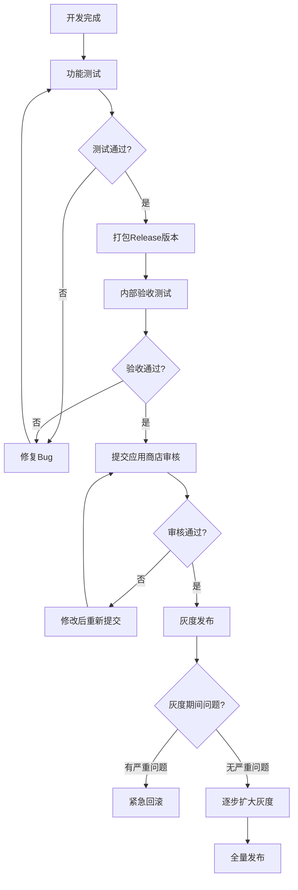

### 17.3 版本发布检查清单

#### 17.3.1 功能检查

- [ ] 所有P0功能测试通过
- [ ] 所有P1功能测试通过
- [ ] 主要流程走通无阻塞
- [ ] 编辑功能正常可用
- [ ] 导入导出功能正常

#### 17.3.2 性能检查

- [ ] 冷启动时间 < 1.5秒
- [ ] 内存占用 < 150MB（正常使用）
- [ ] 无内存泄漏
- [ ] 列表滑动流畅
- [ ] 悬浮窗响应及时

#### 17.3.3 兼容性检查

- [ ] Android 8.0 以上版本测试通过
- [ ] 主流厂商机型测试通过
- [ ] 不同分辨率适配正常
- [ ] 全面屏/挖孔屏适配正常
- [ ] 横屏/竖屏切换正常

#### 17.3.4 安全检查

- [ ] 已关闭Debug模式
- [ ] 代码已混淆
- [ ] 敏感信息未硬编码
- [ ] 日志级别已调整为Release
- [ ] 签名正确

### 17.4 紧急发布与回滚

#### 17.4.1 热更新方案

**适用场景**：
- 严重Bug需要紧急修复
- 小功能快速上线
- 安全漏洞修复

**技术方案**：
- 推荐：Tinker / AndFix 等热更新框架
- 限制：只能修复Java/Kotlin代码，不能修改资源和布局

#### 17.4.2 回滚机制

- **版本回退**：发现严重问题时，可回退到上一稳定版本
- **灰度暂停**：灰度期间发现问题，立即暂停灰度
- **强制更新**：严重安全问题可通过强制更新修复
- **功能开关**：问题功能可通过配置远程关闭

---

## 18. 兼容性适配设计

### 18.1 Android版本适配

#### 18.1.1 版本支持范围

| Android版本 | API级别 | 支持状态 | 适配要点 |
|-------------|---------|----------|----------|
| Android 14 | API 34 | ✅ 完全支持 | 部分存储权限变更、通知权限 |
| Android 13 | API 33 | ✅ 完全支持 | 通知运行时权限、按应用语言偏好 |
| Android 12 | API 31/32 | ✅ 完全支持 | 悬浮窗权限变更、精确闹钟权限 |
| Android 11 | API 30 | ✅ 完全支持 | 分区存储、包可见性 |
| Android 10 | API 29 | ✅ 完全支持 | 分区存储、深色模式 |
| Android 9 | API 28 | ✅ 完全支持 | 前台服务权限 |
| Android 8.0/8.1 | API 26/27 | ✅ 完全支持 | 通知渠道、后台执行限制 |
| Android 7.x | API 24/25 | ⚠️ 有限支持 | 部分功能可能受限，建议升级 |
| Android 6.0及以下 | API 23及以下 | ❌ 不支持 | 无障碍服务API不完整 |

#### 18.1.2 各版本适配要点

**Android 12+ 适配**：
- 悬浮窗：需要申请 `SYSTEM_ALERT_WINDOW` 权限，且有新的限制
- 精确闹钟：需要 `SCHEDULE_EXACT_ALARM` 权限（定时触发功能用）
- 启动画面：适配 SplashScreen API

**Android 11+ 适配**：
- 分区存储：脚本文件存储在应用私有目录或SAF方式
- 包可见性：查询其他应用时需要 `<queries>` 声明

**Android 10+ 适配**：
- 深色模式：支持系统深色模式切换
- 手势导航：悬浮窗避开手势导航区域

### 18.2 厂商ROM适配

#### 18.2.1 主要厂商适配清单

| 厂商 | 适配要点 | 常见问题 |
|------|----------|----------|
| **小米 (MIUI)** | 悬浮窗权限、后台弹出界面、自启动管理 | 悬浮窗被自动关闭、后台服务被杀 |
| **华为 (HarmonyOS/EMUI)** | 电池优化、自启动、悬浮窗权限 | 后台被杀死、无障碍服务自动关闭 |
| **OPPO (ColorOS)** | 悬浮窗权限、后台管理、自启动 | 锁屏后服务停止、权限被自动收回 |
| **vivo (OriginOS/Funtouch)** | 悬浮窗权限、后台高耗电、自启动 | 高耗电提示、后台清理 |
| **荣耀 (Magic UI)** | 电池优化、自启动管理 | 类似华为，后台管理严格 |
| **三星 (One UI)** | 悬浮窗权限、电池优化 | 相对标准，问题较少 |
| **原生Android** | 标准API | 兼容性最好 |

#### 18.2.2 无障碍服务适配

| 厂商 | 问题 | 解决方案 |
|------|------|----------|
| 小米 | 无障碍服务被系统自动关闭 | 引导用户加入自启动、关闭电池优化 |
| 华为 | 锁屏后无障碍失效 | 引导设置锁屏不清理、忽略电池优化 |
| OPPO/vivo | 后台一段时间后服务被停 | 前台服务 + 加入后台白名单 |
| 通用 | 重启手机后服务未自动启动 | 监听开机广播，检测服务状态 |

#### 18.2.3 悬浮窗权限适配

| 厂商 | 跳转设置页方式 | 注意事项 |
|------|---------------|----------|
| 小米 | `Settings.ACTION_MANAGE_OVERLAY_PERMISSION` | MIUI有单独的悬浮窗权限管理 |
| 华为 | 同上 | EMUI 8.0+ 路径不同 |
| OPPO | 同上 | ColorOS 有单独的悬浮窗开关 |
| vivo | 同上 | 需要引导用户手动找到悬浮窗权限 |
| 通用 | `ACTION_MANAGE_OVERLAY_PERMISSION` | Android 6.0+ 标准跳转 |

### 18.3 屏幕适配

#### 18.3.1 分辨率适配

| 屏幕类型 | 分辨率范围 | 适配策略 |
|----------|-----------|----------|
| 小屏手机 | < 5.5英寸 | 确保文字可读、按钮可点击 |
| 常规手机 | 5.5 - 6.7英寸 | 主要适配目标 |
| 大屏手机/折叠屏 | > 6.7英寸 | 优化内容展示，不盲目放大 |
| 平板 | > 7英寸 | 可选平板布局（v2.0考虑） |

#### 18.3.2 异形屏适配

- **刘海屏/挖孔屏**：悬浮窗避开刘海区域
- **全面屏手势**：悬浮窗避开底部手势区域
- **曲面屏**：边缘吸附时考虑曲面弧度
- **折叠屏**：展开/折叠时悬浮窗位置自适应

### 18.4 兼容性测试策略

#### 18.4.1 测试机型选择

- **覆盖主流厂商**：小米、华为、OPPO、vivo、三星
- **覆盖系统版本**：Android 8.0 - Android 14
- **覆盖屏幕类型**：刘海屏、挖孔屏、全面屏
- **覆盖特殊场景**：折叠屏、平板

#### 18.4.2 兼容性测试重点

1. **无障碍服务**：是否能正常开启、是否会被系统关闭
2. **悬浮窗**：是否能正常显示、权限是否正确
3. **后台运行**：锁屏后是否能继续运行、是否被系统杀死
4. **录制回放**：各机型上录制回放是否准确
5. **权限跳转**：是否能正确跳转到对应设置页

---

## 附录

### A. 参考资料

1. Android AccessibilityService 官方文档
2. Jetpack Compose 官方指南
3. Material Design 3 设计规范
4. Android 性能优化最佳实践

### B. 相关文档

- [API 设计文档]()
- [数据库设计文档]()
- [测试用例详细文档]()
- [部署运维手册]()

---

**文档版本**：v2.0  
**创建日期**：2026-06-27  
**最后更新**：2026-06-27  
**文档状态**：正式版  
**更新说明**：
1. 优化文档结构，删除重复内容（重复的权限管理小节）
2. 第7章改名为「业务逻辑设计」，明确与第11章「交互设计」的分工（逻辑层 vs UI层）
3. 新增编辑状态机和编辑业务流程
4. 新增数据库详细设计（表结构、字段定义、索引、ER图、版本管理、备份恢复）
5. 新增安全设计章节（数据安全、权限安全、防滥用设计、隐私保护、应用安全）
6. 新增错误处理与异常设计章节（错误码定义、异常分级处理、用户友好提示）
7. 新增日志与监控设计章节（日志级别、日志管理、性能监控、稳定性监控、业务统计）
8. 新增部署与发布设计章节（发布渠道、发布流程、检查清单、紧急发布与回滚）
9. 新增兼容性适配设计章节（Android版本适配、厂商ROM适配、屏幕适配、测试策略）
